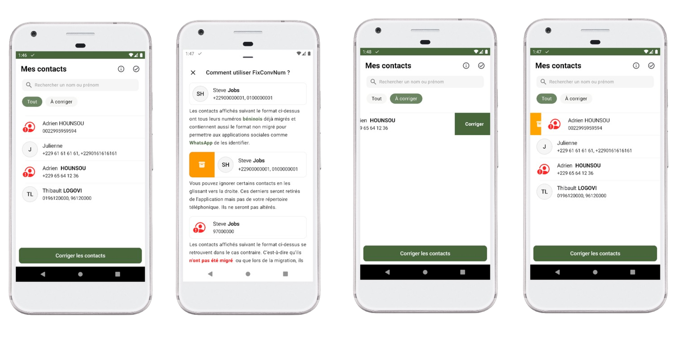

# FixConvNum 🚀



### A simple and efficient solution to migrate and manage beninese contacts! 📲

---

## 📖 About

**FixConvNum** is an application designed to solve a common problem: losing WhatsApp contacts after migrating or switching phones. With FixConvNum, you can:

- Recover lost WhatsApp contacts 📱.
- Easily migrate your contacts while keeping control over which ones to retain ✅.
- Enjoy an ultra-lightweight and fast application  ⚡.

FixConvNum is available on **iOS** and **Android**, with an intuitive interface inspired by each platform's native design.

---

## 📥 Downloads

- **Android Version**: [Download on Google Play](https://play.google.com/store/apps/details?id=com.yanncer.fixconvnum&pcampaignid=web_share)
- **iOS Version**: [Download on the App Store](https://apps.apple.com/app/id6738954815)

---

## ⚙️ Features

- **Recover Lost Contacts**: Easily identify and restore contacts not showing up in WhatsApp.
- **Custom Migration**: Select precisely which contacts to keep.
- **Native Interface**: Designed to feel familiar on both platforms.
- **Lightweight and Fast**: Optimized for high performance without draining your device's resources.

---

## 🛠️ Technologies Used

- **Android**: Built with Kotlin for native performance.
- Clean and minimal design for seamless usability.
- Ultra-lightweight thanks to careful code optimization.

---

## 🚀 Installation & Usage

### For Users:

1. Download the app from your respective store:
    - [Google Play](https://play.google.com/store/apps/details?id=com.yanncer.fixconvnum&pcampaignid=web_share)
    - [App Store](https://apps.apple.com/app/id6738954815)
2. Open the app and follow the simple instructions to recover or migrate your contacts.

### For Developers:

Clone this repository to explore the code or contribute:

```bash
git clone <https://github.com/spencer2k19/FixConvNum.git>

```

---

### For iOS :

Please visit: https://github.com/ezengold/fix-conv-num

## 🌟 Contributing

Contributions are welcome! Here’s how you can help:

1. **Fork the repository**.
2. **Create a branch** for your feature or bug fix (`git checkout -b feature/awesome-feature`).
3. Make your changes and **commit them** (`git commit -m 'Add an awesome feature'`).
4. **Push your changes** (`git push origin feature/awesome-feature`).
5. Open a **Pull Request**.

---

## 📜 License

This project is licensed under the [MIT License](https://chatgpt.com/c/LICENSE). You are free to use, modify, and redistribute it.

---

## 🌟 Acknowledgements

A huge thank you to everyone supporting **FixConvNum** and contributing to its success! 🎉

---

```

This version is polished, clear, and structured for readability. Let me know if you'd like to add or adjust anything! 😊🚀

```